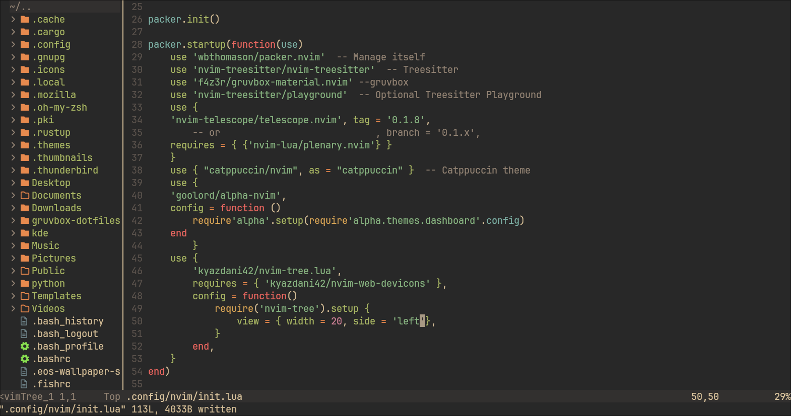
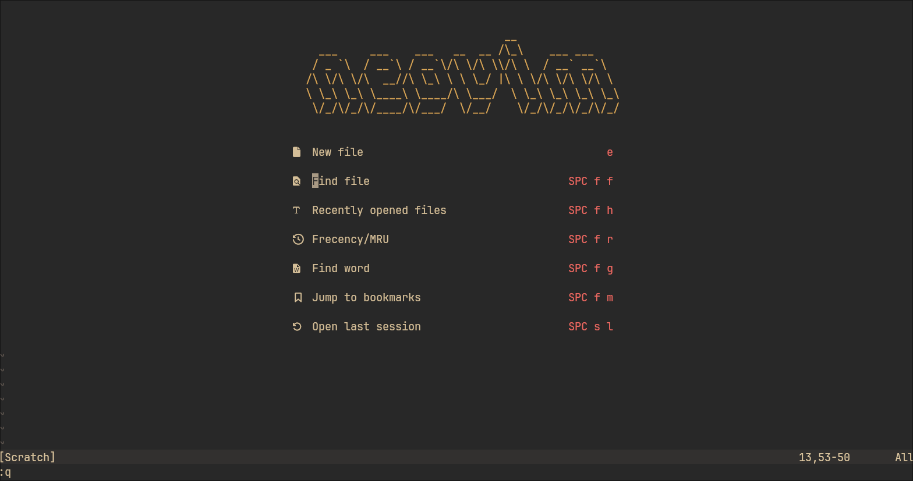
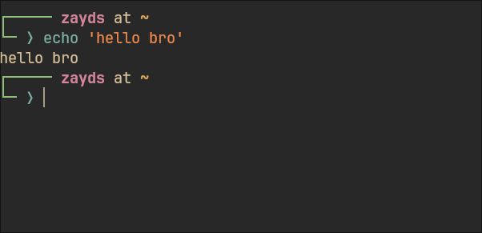
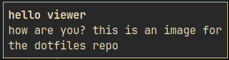
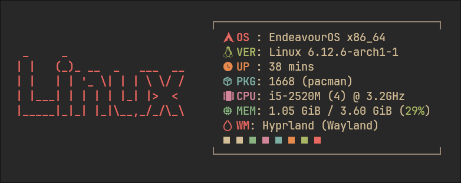

# Dotfiles
My new dotfiles, with gruvbox and gruvbox material.\
There's many things here.\
Dunst, a notification service.\
Hyprland, a tiling window manager.\
Waybar, a status bar for Wayland compositors.\
GTK, themes and other stuff for GTK apps.\
Kitty, a terminal emulator.\
Rofi, an app launcher. Wayland users like me, install `rofi-wayland`.\
Fastfetch, a terminal fetch program.\
Neovim, a text editor.\
And finally....\
Starship, the infinitely customizable cross-platform prompt.\
Now some of these have dependencies which you like, need, to install. So let me list them.
### Hyprland Dependencies
- `waybar`
- `dunst`
- `kitty`, the terminal emulator.
- `rofi-wayland`
- `rofimoji`. This is an emoji keyboard.
- `thunar`, This is a file manager, the best one IMO.
- `papirus-icon-theme`. THis is mainly for Rofi.
- `swww`, a wallpaper utility.
- `rofi-power-menu`
- `wl-clipboard`, to handle copying and pasting.
- `grim` and `slurp`, which are screenshotting tools.
### Neovim
This isn't really a dependency but you WILL need to install it. This is the plugin manager, Packer. You can see the install instructions on their GitHub page.
## Screenshots:
### 
Hyprland and Waybar

### Neovim

  

### Kitty + Starship

The shell here is `fish` by the way.

### Rofi

  

### Dunst

  

### Fastfetch

The CPU module's text is hardcoded, so you will need to remove the "format": line in the CPU module in order to display your system's CPU.

